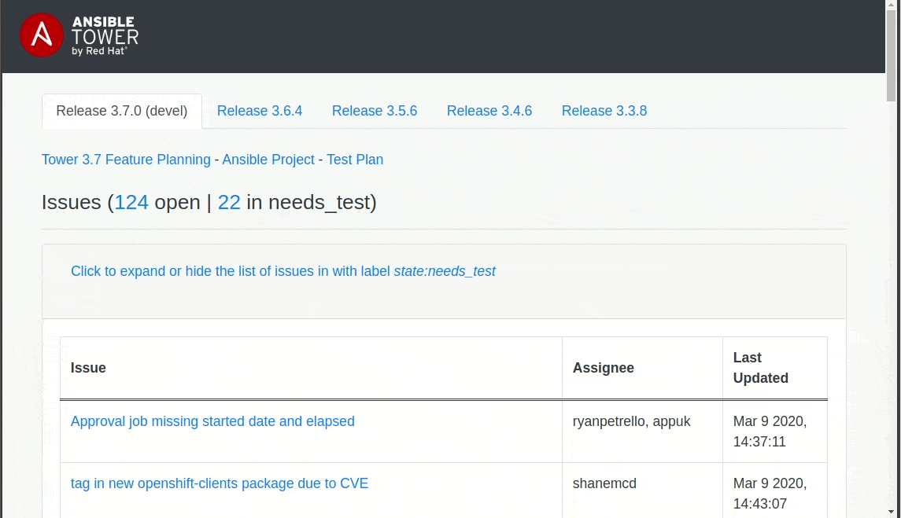
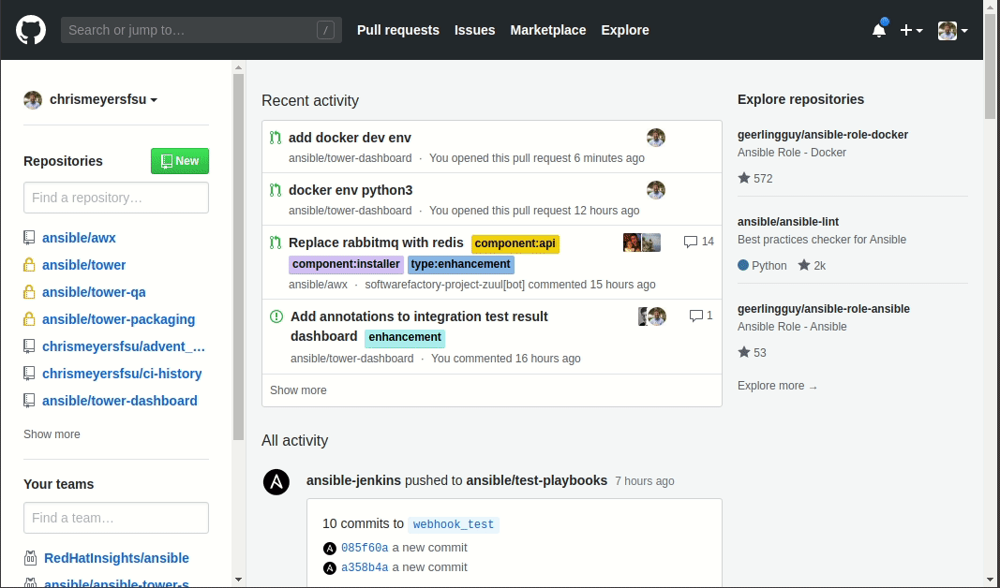

[](https://opensource.org/licenses/Apache-2.0)

# Tower QE Dashboard

A set of Tower QE dashboard that allows to have better insight of what is going on



## Install Prerequisites

### Github Personnal Access Token

The dashboard sources information from github repos (i.e. branches, issues, projects, etc.). The dashboard accesses github using a Github Personal Access Token. The screen capture below shows you how to create a Github Personal Access Token. Save the token to `GITHUB_TOKEN` in your `settings.py` (defined later).



## Production Install

```
make build-prod
TOWERDASHBOARD_SETTINGS=/path_to_prod_settings.py make run-prod
```

### Development

The development container derives from the production container. Therefore, the production container must be built first.

```
make build-prod
make build
cp settings.sample.py settings.py
make run
```

tower-dashboard should be running on your local loop on port 5000 (`http://127.0.0.1:5000`)


## Sending data to the dashboard

### Top level results

To update results of of entire os/anisble pipelines (shown in matrix) or the Openshift/Artifacts results, have pipeline POST to the dashboard in the following manner:

```bash
curl -d '{"os":"rhel-7.7-x86_64", "ansible":"devel", "tower": "devel", "status": "SUCCESS", "url": "https://myjobrunner.net/job/1"}' -H 'Content-type: application/json' -X POST http://127.0.0.1:5000/jenkins/results
```

### Sign off jobs
To update results for the sign off jobs displayed in the lower portion of each release tab, have jobs POST to the dashboard in the following manner:
```bash
curl -d \
  '{"tower":"devel", "url":"https://your.job.runner.com/job/1", "component":"install", "status":"FAILURE", "tls":"yes", "fips":"no", "bundle": "no", "deploy":"standalone", "platform":"rhel-7.7-x86_64", "ansible": "devel"}' \
  -H 'Content-type: application/json' -X POST http://127.0.0.1:5000/jenkins/sign_off_jobs
```
This will correlate it to one of the jobs created at database initializaion time and update the latest result.
These are unique on combination of the parameters:

1)  `"tower"` matching a `"code"` in the list of `TOWER_VERSIONS` found in the [base data used](https://github.com/ansible/tower-dashboard/blob/master/towerdashboard/data/base.py)

1)  `"component"` matching an item in the list of `SIGN_OFF_COMPONENTS` found in the [base data used](https://github.com/ansible/tower-dashboard/blob/master/towerdashboard/data/base.py)

1)  `"deploy"` matching a value of `"deploy"` in the list of `SIGN_OFF_DEPLOYMENTS` found in the [base data used](https://github.com/ansible/tower-dashboard/blob/master/towerdashboard/data/base.py), e.g. `"standalone"` or `"cluster"`.

1)  `"tls"` matching a value of `"tls"` in the list of `SIGN_OFF_DEPLOYMENTS` found in the [base data used](https://github.com/ansible/tower-dashboard/blob/master/towerdashboard/data/base.py), e.g. `'yes'` or `'no'`.

1)  `"fips"` matching a value of `"fips"` in the list of `SIGN_OFF_DEPLOYMENTS` found in the [base data used](https://github.com/ansible/tower-dashboard/blob/master/towerdashboard/data/base.py), e.g. `'yes'` or `'no'`.

1)  `"bundle"` matching a value of `"bundle"` in the list of `SIGN_OFF_DEPLOYMENTS` found in the [base data used](https://github.com/ansible/tower-dashboard/blob/master/towerdashboard/data/base.py), e.g. `'yes'` or `'no'`.

1)  `"platform"` matching an item in the list of `SIGN_OFF_PLATFORMS` found in the [base data used](https://github.com/ansible/tower-dashboard/blob/master/towerdashboard/data/base.py), e.g. `rhel-7.7-x86_64` or `OpenShift`.

1)  `"ansible"` matching an item in the list of `ANSIBLE_VERSIONS` found in the [base data used](https://github.com/ansible/tower-dashboard/blob/master/towerdashboard/data/base.py), e.g. `rhel-7.7-x86_64` or `OpenShift`.

1)  `"status"` matching a job result from Jenkins, e.g. `"SUCCESS"`, `"FAILURE"`, `"UNSTABLE"`.


## Exporting data from API

### Sign off jobs

You can get the raw json data for any given tower release for the sign off jobs by sending a GET request like this:

```bash
curl -H 'Content-type: application/json' -X GET http://127.0.0.1:5000/jenkins/sign_off_jobs?tower=devel
```

Currently only filtering on `tower` e.g. tower version is implemented.

## License

Apache 2.0


## Contact

  * Tower QE  <ansible-tower-qe@redhat.com>
